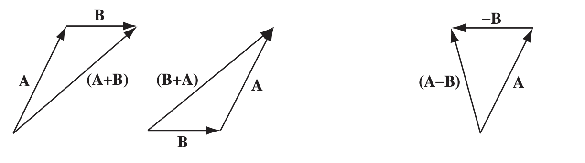
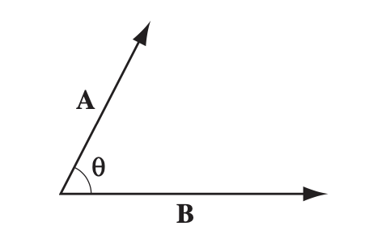
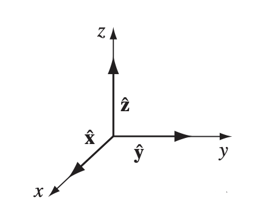
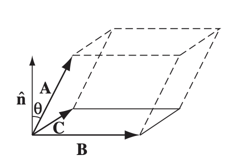
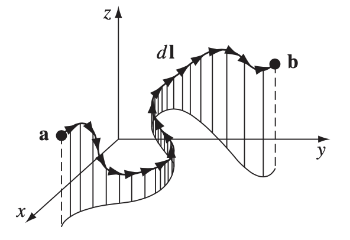
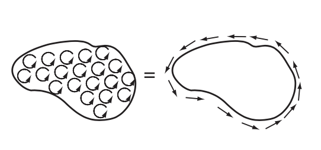
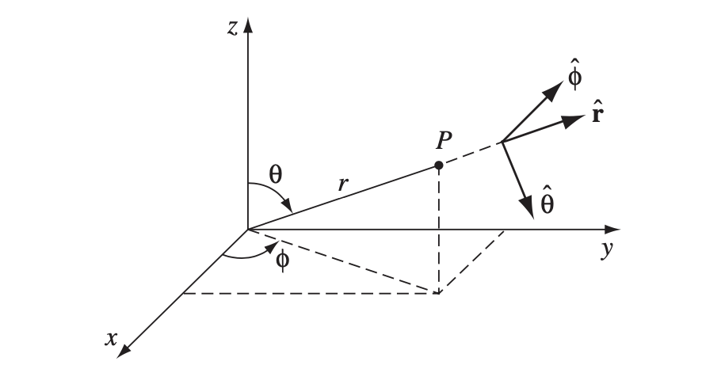
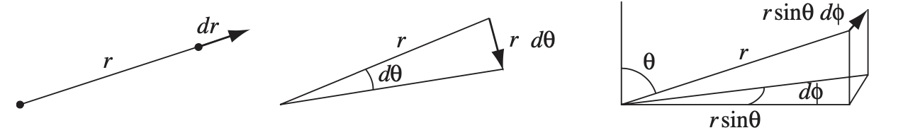
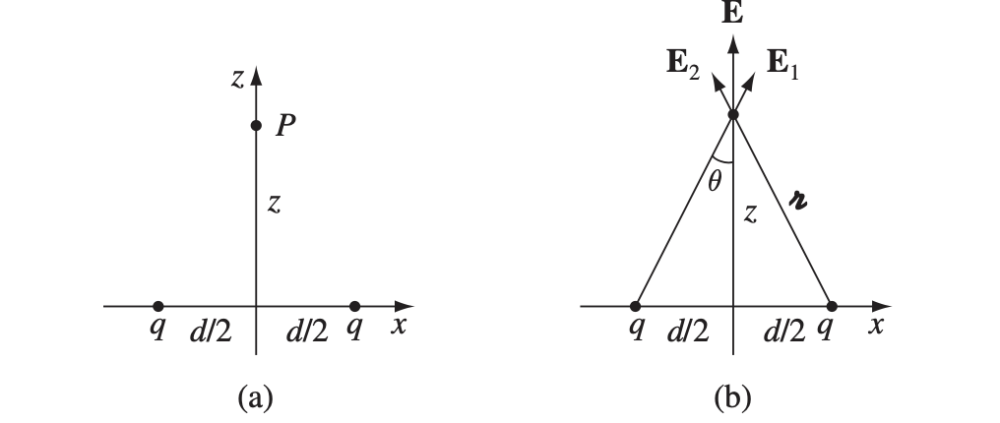
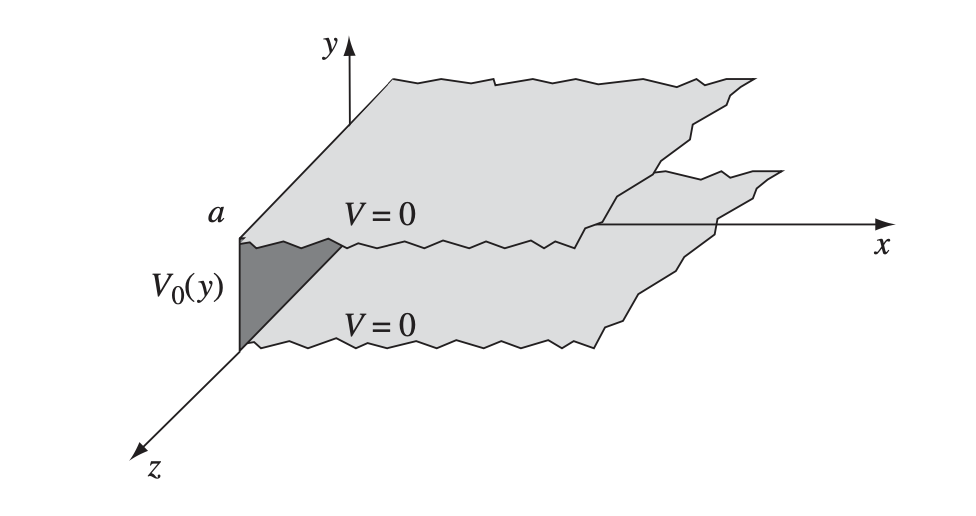

# Electrodynamics I

本笔记是对应 *UIUC PHYS 435 Advanced Electromagnetism I* 的学习笔记，其中包括了矢量微积分、偏微分方程、静电学、静磁学相关的知识点。

[TOC]

**电动力学（Electrodynamics）** 研究的核心问题就是已知一系列 **源电荷（Source Charge）**，它们对另一个 **测试电荷（Test Charge）** 的作用是怎么样的。其中源电荷和测试电荷的初始状态（位置，速度）给定时，我们需要尝试计算出测试电荷的运动轨迹。这个问题可以通过 **叠加原理（Principle of Superposition）** 显著简化：由于电磁力和电荷的电量成线性比例，我们可以将一个个源电荷孤立出来处理。如果源电荷 $q_i$ 对测试电荷 $Q$ 的力为 $\mathbf{F}_i$，则所有源电荷都存在的情况下 $Q$ 受到的力就是 $\sum \mathbf{F}_i$。实验表明，一个源电荷 $q$ 对测试电荷 $Q$ 的电磁力通常与它们的电量、速度、 $q$ 的加速度以及两者的距离 $\mathscr{r}$ 相关。由于两者可能都在运动，考虑所有因素的分析会异常复杂。所以，我们将一步步构建电动力学中影响作用力的因素，从简单的问题中理解电磁场的性质。

## 矢量分析

在开始电动力学的学习之前，我们首先应该熟悉 **矢量微积分（Vector Calculus）**，它在本文的公式中占有极大的篇幅。许多物理量除了大小，还有方向的性质，比如一段位移 **r**，我们不仅关心它的大小（距离），也关心它的起点和终点。我们将这样的物理量称为称为 **矢量（Vector）**，而其它的物理量（比如温度、质量等）被称为 **标量（Scalar）**。

让我们做符号格式的约定。本篇全文中，所有的符号如果没有经过粗体处理，如 $x, \alpha, B$，都是标量；相反如果经过粗体处理，如 $\mathbf{z}, \mathbf{A}$ 则视为矢量。和矢量有关的概念和记号如下：

- 一个矢量 $\mathbf{A}$ 的大小 $|\mathbf{A}|$ 会被简记为 $A$。
- 与矢量 $\mathbf{A}$ 大小相同，方向相反的矢量记为 $-\mathbf{A}$。
- 与矢量 $\mathbf{A}$ 方向相同，长度为其 $k$ 倍的矢量记为 $k\mathbf{A}$。
- 与矢量 $\mathbf{A}$ 方向相同，单位长度的矢量记为 $\hat{\mathbf{A}}$。
- 大小为 $0$ 的矢量记为 $\mathbf{0}$，注意它和 $0$ 的区别。

### 矢量的运算

矢量的加减法可以参考下面的图片。这个法则是基于一个公理：只要两个矢量拥有相同的大小和方向，它们就是相等的矢量。因此我们可以通过平移矢量得到期望的图形：

可以看到，矢量的加减法非常符合我们的直觉：只需要将两个矢量的头尾相连就可以得到它们的和；而两个矢量的差等于一个矢量加上另一个矢量的逆。

矢量的 **点乘（Dot Product）** 描述了两个矢量在同一方向共同的作用效果，大小为两个矢量大小之积乘以它们夹角的余弦，即：
$$
\mathbf{A}\cdot\mathbf{B} = AB\cos{\theta}
$$
可以参考下图：

特别地有 $\mathbf{A}\cdot\mathbf{A} = A^2$。从几何角度理解，点乘是将一个矢量投影到另一个矢量的方向上之后两者的乘积。物理学中的功 $W = \int\mathbf{F}\cdot\,d\mathbf{l}$ 是比较典型的使用点乘的例子。通过点乘的定义我们可以轻易地得到余弦定理：
$$
c^2 = \mathbf{c}\cdot\mathbf{c} = (\mathbf{a} - \mathbf{b})\cdot(\mathbf{a} - \mathbf{b}) = \mathbf{a}\cdot\mathbf{a} - 2\mathbf{a}\cdot\mathbf{b} + \mathbf{b}\cdot\mathbf{b} = a^2 + b^2 -2ab\cos\theta
$$
矢量的 **叉乘（Cross Product）** 定义为垂直于两个矢量所在平面的矢量，大小为两个矢量大小之积乘以它们夹角的正弦，方向则满足 **右手定则（Right-Hand Rule）**：
$$
\mathbf{A}\times\mathbf{B} = AB\sin\theta\hat{\mathbf{n}}
$$
其中 $\hat{\mathbf{n}}$ 是满足右手定则的法向量，该定则描述如下：将四指指向第一个矢量的方向，大拇指处于同一平面并垂直于它们，然后使得四指能通过较小角度转到第二个矢量的方向时，大拇指的方向就是 $\hat{\mathbf{n}}$ 的方向。为了更好说明这个方向，我们以笛卡尔坐标系为例：

上图中，通过叉乘定义有：
$$
\begin{align}
	\hat{\mathbf{x}}\times\hat{\mathbf{y}} = \hat{\mathbf{z}} && \hat{\mathbf{y}}\times\hat{\mathbf{z}} = \hat{\mathbf{x}} && \hat{\mathbf{z}}\times\hat{\mathbf{x}} = \hat{\mathbf{y}}
\end{align}
$$
特别地有 $\mathbf{A}\times\mathbf{A} = \mathbf{0}$。此外，通过右手定则不难发现叉乘不满足交换律，即 $\mathbf{A}\times\mathbf{B} = -\mathbf{B}\times\mathbf{A}$。

### 矢量的分量表示

在 $n$ 维空间中，对于线性无关的 $n$ 个矢量 $\hat{\mathbf{e}}_1,...,\hat{\mathbf{e}}_n$，对给定的 $n$ 维矢量 $\mathbf{A}$ 总能找到唯一的 $n$ 元组 $(A_1,...,A_n)$ 使得下式成立：
$$
\mathbf{A} = \sum_{i=1}^n A_i\hat{\mathbf{e}}_i
$$
因此，我们对笛卡尔坐标系中的向量 $\mathbf{A}$ 总能写成下面的形式：
$$
\mathbf{A} = A_x\hat{\mathbf{x}} + A_y\hat{\mathbf{y}} + A_z\hat{\mathbf{z}}
$$
我们可以根据此定义给出向量加减法、点乘和叉乘在笛卡尔坐标系中的计算公式：
$$
\begin{align}
\begin{split}
	\mathbf{A} + \mathbf{B} &= (A_x + B_x)\hat{\mathbf{x}} + (A_y + B_y)\hat{\mathbf{y}} + (A_z + B_z)\hat{\mathbf{z}} \\
	\mathbf{A} \cdot \mathbf{B} &= A_xB_x + A_yB_y + A_zB_z \\
	\mathbf{A} \times \mathbf{B} &= (A_yB_z - A_zB_y)\hat{\mathbf{x}} + (A_zB_x - A_xB_z)\hat{\mathbf{y}} + (A_xB_y - A_yB_x)\hat{\mathbf{z}}
\end{split}
\end{align}
$$
其中叉乘的公式可以通过行列式变得更加优雅：
$$
\mathbf{A}\times\mathbf{B} = 
\begin{vmatrix}
	\hat{\mathbf{x}} & \hat{\mathbf{y}} & \hat{\mathbf{z}} \\
	A_x & A_y & A_z \\
	B_x & B_y & B_z
\end{vmatrix}
$$
现在计算点乘变得如此简单，我们可以利用点乘的定义得到两个向量之间的夹角：
$$
\cos{\theta} = \frac{\mathbf{A}\cdot\mathbf{B}}{AB} = \frac{A_xB_x + A_yB_y + A_zB_z}{\sqrt{(A_x^2 + A_y^2 + A_z^2)(B_x^2 + B_y^2 + B_z^2)}}
$$
最后让我们介绍两种常见的矢量连乘公式：$\mathbf{A}\cdot(\mathbf{B}\times\mathbf{C})$ 和 $\mathbf{A}\times(\mathbf{B}\times\mathbf{C})$。其中第一个式子的结果是一个标量，$\mathbf{B}\times\mathbf{C}$ 得到了垂直于 $\mathbf{B}$、$\mathbf{C}$ 所在平面的矢量 $BC\sin\theta\hat{\mathbf{n}}$，随后它与 $\mathbf{A}$ 的点乘正好得到了 $\mathbf{A}$ 到 $\mathbf{B}$、$\mathbf{C}$ 所在平面的距离。通过下面的图片来理解，我们不难发现这个结果就是所示平行六面体的体积：

另一个 $\mathbf{A}\times(\mathbf{B}\times\mathbf{C})$ 可以通过叉乘在笛卡尔坐标系的计算方式强行得到下面的结果：
$$
\mathbf{A}\times(\mathbf{B}\times\mathbf{C}) = \mathbf{B}(\mathbf{A}\cdot\mathbf{C}) - \mathbf{C}(\mathbf{A}\cdot\mathbf{B})
$$
 类似地也有：
$$
(\mathbf{A}\times\mathbf{B})\times\mathbf{C} = -\mathbf{A}(\mathbf{B}\cdot\mathbf{C}) + \mathbf{B}(\mathbf{A}\cdot\mathbf{C})
$$
通过上面两个公式，我们就可以得到任意的矢量点乘叉乘混合的结果了。

在进入更深层次的矢量分析之前，让我们确立物理学中的 **位置（Position）**、**位移（Displacement）** 和 **分离矢量（Separation Vector）** 等概念和它们的记号。位置矢量指的是空间中从原点指向某一点的矢量，通常记为 $\mathbf{r}$。电动力学中通常关心两个位置矢量，它们是 **场源点（Source Point）**，记为 $\mathbf{r}'$ 和 **场点（Field Point）**，记为 $\mathbf{r}$。从场源点指向场点的矢量则被称为分离矢量，记为 $\boldsymbol{\mathscr{r}}$，它可以定义为：
$$
\boldsymbol{\mathscr{r}} = \mathbf{r} - \mathbf{r}'
$$
位移是指表明位置移动的矢量 $\Delta\mathbf{r} = \mathbf{r}_1 - \mathbf{r}_0$。当这个量取无穷小时我们就得到了无穷小位移矢量 $d\mathbf{l}$：
$$
d\mathbf{l} = d\mathbf{r} = dx\,\hat{\mathbf{x}} + dy\,\hat{\mathbf{y}} + dz\,\hat{\mathbf{z}}
$$

### 矢量微分

#### 梯度

我们默认已经对标量的函数与微分比较熟悉了。对于函数 $f(x)$，它的导数 $\frac{df}{dx}$ 表明其 **斜率（Slope）** 的特征。现在假设函数 $T(x, y, z)$ ，它的“斜率”显得不是那么明显，我们需要考虑它所有方向上单位长度引起的变化：
$$
dT = \frac{\partial T}{\partial x}\,dx + \frac{\partial T}{\partial y}\,dy + \frac{\partial T}{\partial z}\,dz
$$
我们只需要考虑 $x, y, z$ 三个方向即可，因为所有其他方向的变化率都可以通过它们三个的线性组合得到。注意到上面的公式和点乘的相似性。将它重写为向量点乘的形式：
$$
dT = \left(\frac{\partial T}{dx}\hat{\mathbf{x}} + \frac{\partial T}{dx}\hat{\mathbf{y}} + \frac{\partial T}{dx}\hat{\mathbf{z}}\right)\cdot(dx\,\hat{\mathbf{x}} + dy\,\hat{\mathbf{y}} + dz\,\hat{\mathbf{z}}) = \nabla T\cdot d\mathbf{l}
$$
 $\nabla$ 是引入的新记号，我们称其为 **Del 算子（Del Operator）**，其定义如下：
$$
\nabla = \hat{\mathbf{x}}\frac{\partial}{\partial x} + \hat{\mathbf{y}}\frac{\partial}{\partial y} + \hat{\mathbf{z}}\frac{\partial}{\partial z}
$$
可以看到 del 算子和微分算子 $\frac{d}{dx}$ 非常相似。后文中我们将利用 del 算子重新建立微积分中的一些定理，可以时常将其和微分算子对比。

当 $\nabla$ 使用在标量函数前时，会遵循类似于乘法分配律的规则得到：
$$
\nabla T = \left(\hat{\mathbf{x}}\frac{\partial}{\partial x} + \hat{\mathbf{y}}\frac{\partial}{\partial y} + \hat{\mathbf{z}}\frac{\partial}{\partial z}\right)T = \frac{\partial T}{dx}\hat{\mathbf{x}} + \frac{\partial T}{dx}\hat{\mathbf{y}} + \frac{\partial T}{dx}\hat{\mathbf{z}}
$$
我们将这个矢量函数称为 $T$ 的 **梯度（Gradient）**。根据 (15) 式我们也可以发现，梯度是使得 $dT$ 最大的 $d\mathbf{l}$ 方向。如果更加生动地说明，梯度就是站在某点时最陡的（向高处的）方向，而梯度的大小就是这个方向上的斜率。

#### 散度

由于 Del 算子的矢量性质，我们可以尝试得到它和矢量函数的点乘和叉乘。点乘得到的是矢量函数的 **散度（Divergence）**：
$$
\nabla\cdot\mathbf{v} = \left(\hat{\mathbf{x}}\frac{\partial}{\partial x} + \hat{\mathbf{y}}\frac{\partial}{\partial y} + \hat{\mathbf{z}}\frac{\partial}{\partial z}\right)\cdot(v_x\hat{\mathbf{x}} + v_y\hat{\mathbf{y}} + v_z\hat{\mathbf{z}}) = \frac{\partial v_x}{\partial x} + \frac{\partial v_y}{\partial y} + \frac{\partial v_z}{\partial z}
$$
散度的几何意义是某点上一个向量函数的发散程度。我们不加证明地给出其等价的定义：
$$
\nabla\cdot\mathbf{v} = \lim_{V\to 0}\frac{1}{|V|}\oint_{S(V)}\mathbf{v}\cdot\hat{\mathbf{n}}\,dS
$$
也即一个闭合曲面中矢量场的通量（穿过该曲面的积分）与闭合曲面形成体积 $V$ 之比在 $V\to 0$ 的极限。在静电场的章节中我们会再一次看到类似的定义。

#### 旋度

**旋度（Curl）** 则描述了一个矢量函数的旋转程度：
$$
\nabla\times\mathbf{v} = \left(\hat{\mathbf{x}}\frac{\partial}{\partial x} + \hat{\mathbf{y}}\frac{\partial}{\partial y} + \hat{\mathbf{z}}\frac{\partial}{\partial z}\right)\times(v_x\hat{\mathbf{x}} + v_y\hat{\mathbf{y}} + v_z\hat{\mathbf{z}}) =
\begin{vmatrix}
	\hat{\mathbf{x}} & \hat{\mathbf{y}} & \hat{\mathbf{z}} \\
	\partial_x & \partial_y & \partial_z \\
	v_x & v_y & v_z
\end{vmatrix}  \\
= \left(\frac{\partial v_z}{\partial y} - \frac{\partial v_y}{\partial z}\right)\hat{\mathbf{x}} + \left(\frac{\partial v_x}{\partial z} - \frac{\partial v_z}{\partial x}\right)\hat{\mathbf{y}} + \left(\frac{\partial v_y}{\partial x} - \frac{\partial v_x}{\partial y}\right)\hat{\mathbf{z}}
$$

#### 矢量微分的运算定律

现在让我们探索矢量微分的运算规律。标量函数的微分定律可以简单总结如下：
$$
\begin{align}
\begin{split}
	\frac{d}{dx}(f + g) &= \frac{df}{dx} + \frac{dg}{dx} \\
	\frac{d}{dx}(kf) &= k\frac{df}{dx} \\
	\frac{d}{dx}(fg) &= f\frac{dg}{dx} + g\frac{df}{dx} \\
	\frac{d}{dx}\left(\frac{f}{g}\right) &= \frac{g\frac{df}{dx} - f\frac{dg}{dx}}{g^2}
\end{split}
\end{align}
$$
在矢量微分中，也有相当类似的定律，比如加法定律：
$$
\begin{align}
\begin{split}
	\nabla(f + g) &= \nabla f + \nabla g \\
	\nabla\cdot(\mathbf{A} + \mathbf{B}) &= \nabla\cdot\mathbf{A} + \nabla\cdot\mathbf{B} \\
	\nabla\times(\mathbf{A} + \mathbf{B}) &= \nabla\times\mathbf{A} + \nabla\times\mathbf{B}
\end{split}
\end{align}
$$
标量乘法定律：
$$
\begin{align}
\begin{split}
\nabla(kf) &= k\nabla f \\
\nabla\cdot(k\mathbf{A}) &= k(\nabla\cdot\mathbf{A}) \\
\nabla\times(k\mathbf{A}) &= k(\nabla\times\mathbf{A})
\end{split}
\end{align}
$$
梯度定律：
$$
\begin{align}
\begin{split}
	\nabla(fg) &= f\nabla g + g\nabla f \\
	\nabla(\mathbf{A}\cdot\mathbf{B}) &= \mathbf{A}\times(\nabla\times\mathbf{B}) + \mathbf{B}\times(\nabla\times\mathbf{A}) + (\mathbf{A}\cdot\nabla)\mathbf{B} + (\mathbf{B}\cdot\nabla)\mathbf{A} \end{split}
\end{align}
$$
以及矢量乘法定律：
$$
\begin{align}
\begin{split}
	\nabla\cdot(f\mathbf{A}) &= f(\nabla\cdot A) + \mathbf{A}\cdot(\nabla f) \\
	\nabla\cdot(\mathbf{A}\times\mathbf{B}) &= \mathbf{B}\cdot(\nabla\times\mathbf{A}) - \mathbf{A}\cdot(\nabla\times\mathbf{B}) \\
	\nabla\times(f\mathbf{A}) &= f(\nabla\times \mathbf{A}) - \mathbf{A}\times(\nabla f) \\
	\nabla\times(\mathbf{A}\times\mathbf{B}) &= (\mathbf{B}\cdot\nabla)\mathbf{A} - (\mathbf{A}\cdot\nabla)\mathbf{B} + \mathbf{A}(\nabla\cdot{B}) - \mathbf{B}(\nabla\cdot\mathbf{A})
\end{split}
\end{align}
$$
上面这一系列定律都可以通过矢量的运算定律以及梯度、散度和旋度的定义得到。

#### 二阶导数

我们可以使用两次 del 算子以得到函数的二阶导数。其中最常用的是梯度的散度，我们称其为 **拉普拉斯（Laplacian）**：
$$
\nabla\cdot(\nabla T) = \left(\hat{\mathbf{x}}\frac{\partial}{\partial x} + \hat{\mathbf{y}}\frac{\partial}{\partial y} + \hat{\mathbf{z}}\frac{\partial}{\partial z}\right)\cdot\left(\frac{\partial T}{dx}\hat{\mathbf{x}} + \frac{\partial T}{dx}\hat{\mathbf{y}} + \frac{\partial T}{dx}\hat{\mathbf{z}}\right) = \frac{\partial^2T}{\partial x^2} + \frac{\partial^2 T}{\partial y^2} + \frac{\partial^2 T}{\partial z^2}
$$
我们经常将上面式子简写为 $\nabla^2 T$，其中 $\nabla^2$ 是一个新定义的算子，称为 **拉普拉斯算子（Laplacian Operator）**：
$$
\nabla^2 = \frac{\partial^2}{\partial x^2} + \frac{\partial^2}{\partial y^2} + \frac{\partial^2}{\partial z^2}
$$
偶尔我们也会对矢量使用拉普拉斯算子，此时它代表对矢量的不同分量分别进行不同方向的求拉普拉斯：
$$
\nabla^2\mathbf{v} = (\nabla^2v_x)\hat{\mathbf{x}} + (\nabla^2v_y)\hat{\mathbf{y}} + (\nabla^2v_z)\hat{\mathbf{z}}
$$
除了梯度的散度，我们还可能得到：

- 梯度的旋度。我们可以通过其定义证明：
  $$
  \nabla\times(\nabla T) = \mathbf{0}
  $$
  这是一个很重要的结论。通常被用来判断一个矢量场 $\nabla T$ 是否是某个标量场 $T$ 的梯度。

- 散度的梯度，即 $\nabla(\nabla\cdot \mathbf{v})$。遗憾的是，在物理学中这个表达式很少被用到，因此对它的兴趣寥寥。但注意散度的梯度 *不等于* 梯度的散度！

- 旋度的散度。我们可以通过其定义证明：
  $$
  \nabla\cdot(\nabla\times\mathbf{v}) = 0
  $$

- 旋度的旋度。其计算可以参考矢量连乘公式：
  $$
  \nabla\times(\nabla\times \mathbf{v}) = \nabla(\nabla\cdot\mathbf{v}) - \nabla^2\mathbf{v}
  $$
  此式也常作为矢量的拉普拉斯定义式。

### 矢量积分

在电动力学中，我们最常见到的几种积分即是 **线积分（Line Integral）**、**面积分（Surface Integral）** 和 **体积分（Volume Integral）**。我们下面进行简单的展示说明：

- 线积分：沿着一个路径的积分，定义如下：
  $$
  \int_\mathbf{a}^\mathbf{b}\mathbf{v}\cdot d\mathbf{l}
  $$
  其中 $\mathbf{v}$ 是一个矢量函数，$d\mathbf{l}$ 则是无穷小位移矢量，描述了积分路径的方向，可以参考下图：

  

  当线积分的初始点 $\mathbf{a}$ 和终止点 $\mathbf{b}$ 重合时，这就变成了一个闭合曲线，此时我们将线积分记为下面的形式：
  $$
  \oint \mathbf{v}\cdot d\mathbf{l}
  $$
  

- 面积分：垂直作用于一个曲面的积分：
  $$
  \int_\mathcal{S}\mathbf{v}\cdot d\mathbf{a}
  $$
  其中 $\mathcal{S}$ 是积分针对的曲面，$d \mathbf{a}$ 则是一个无穷小面积的法向量。显然一块面积的法向量有两个，因此此处可能会产生歧义，在积分时应该明确说明面积的方向。如果 $\mathcal{S}$ 是闭合的，我们就可以将面积分记为：
  $$
  \oint \mathbf{v}\cdot d\mathbf{a}
  $$
  我们对面积分还有一个常用的称呼。考虑将 $\mathbf{v}$ 视为单位时间单位截面上某个流体的质量时，那么 $\int\mathbf{v}\cdot d\mathbf{a}$ 能够描述单位时间通过某个面的流体质量。我们因此也将其称为 **通量（Flux）**。

- 体积分：对某个体积的积分：
  $$
  \int_\mathcal{V}T\,d\tau
  $$
  这里 $T$ 是一个标量函数，而 $d\tau$ 是一个无穷小体积。在笛卡尔坐标系中可以轻易得到：
  $$
  d\tau = dx\,dy\,dz
  $$
  偶尔我们也会遇到矢量函数的体积分：
  $$
  \int\mathbf{v}\,d\tau = \hat{\mathbf{x}}\int v_x\,d\tau + \hat{\mathbf{y}}\int v_y\,d\tau + \hat{\mathbf{z}}\int v_z\,d\tau
  $$

#### 微积分基本定理

虽然大家它可能已经很熟悉了，但是为了和后面将要提到的其它基本定理比较，这里还是将 **微积分基本定理（The Fundamental Theorem of Calculus）** 写出来：
$$
\int_a^b\left(\frac{df}{dx}\right)\,dx = f(b) - f(a)
$$
其几何意义是显然的。下面让我们对矢量微积分中导数的三种变形：梯度、散度和旋度分别给出类似的基本定理：

#### 梯度基本定理

在一个线积分中，任取一段无穷小的路径 $d\mathbf{l}$ 都有 $dT = \nabla T \cdot d\mathbf{l}$（我们此前在 (15) 式中已经给出）。因此对于完整的线积分：
$$
\int_\mathbf{a}^\mathbf{b}(\nabla T)\cdot d\mathbf{l} = T(\mathbf{b}) - T(\mathbf{a})
$$
这也即是 **梯度基本定理（The Fundamental Theorem for Gradients）**。其几何意义在于，空间中任意两点的“高度差”等价于连接它们的路径上每个“高度”变化的和。和微积分基本定理对比我们可以发现，它们的特征都在于，一个积分的结果只取决于边界点，和中间过程（路径）无关。物理学中，如果一个矢量场的线积分和路径无关，我们就称其为 **保守的（Conservative）**。从梯度基本定理来看，一个矢量场保守的充分条件是这个场是某个标量场的梯度。我们可以从该定理迅速得到一个推论 ：
$$
\oint (\nabla T)\cdot d\mathbf{l} = 0
$$

#### 散度基本定理

**散度基本定理（The Fundamental Theorem for Divergences）** 将面积分和散度的体积分联系到了一起：
$$
\underset{\mathcal{V}}{\int}(\nabla\cdot\mathbf{v})\,d\tau = \underset{\mathcal{S}}{\oint}\mathbf{v}\cdot d\mathbf{a}
$$
它也被称为 **高斯定理（Gauss's Theorem）**、**格林定理（Green's Theorem）** 或 **散度定理（Divergence Theorem）**。其几何意义在于，一个闭合曲面的通量等于该曲面包围的面积内总量的变化值。同样地，这也将一个积分（等式左侧）的结果取决于其边界区域（等式右侧的曲面）。

#### 旋度基本定理

**旋度基本定理（The Fundamental Theorem for Curls）** 将旋度对某曲面的通量和该曲面边界的线积分联系到了一起：
$$
\underset{\mathcal{S}}{\int}(\nabla\times \mathbf{v})\cdot d\mathbf{a} = \underset{\mathcal{P}}{\oint}\mathbf{v}\cdot d\mathbf{l}
$$
这也被称为 **斯托克斯定理（Stokes' Theorem）**。其几何意义在于，一个曲面内旋度的总量等于其边界处一圈的变化之和。通过图片能够更好理解这一点：

和梯度基本定理类似，我们发现旋度的通量和所选曲面无关，只和曲面边界有关；对于闭合曲面，我们总有：
$$
\oint(\nabla \times\mathbf{v}) \cdot d\mathbf{a} = 0
$$

#### 分部积分

通过对微分乘法定律 $(fg)' = fg' + gf'$ 的应用，我们可以得到 **分部积分（Integration by Parts）**的积分方法：
$$
\int_a^b f\left(\frac{dg}{dx}\right)\,dx = -\left.\int_a^b g\left(\frac{df}{dx}\right)\,dx + fg\right|_a^b
$$
类似地，我们也可以将矢量微分中介绍的乘法定律变为积分的形式，比如：
$$
\int\nabla\cdot(f\mathbf{A})\,d\tau = \int f(\nabla\cdot\mathbf{A})\,d\tau + \int\mathbf{A}\cdot(\nabla f)\,d\tau\nonumber
$$
根据散度定理我们可以进一步得到：
$$
\int_\mathcal{V} f(\nabla\cdot\mathbf{A})\,d\tau = -\int_\mathcal{V}\mathbf{A}\cdot(\nabla f)\,d\tau + \oint_\mathcal{S} f\mathbf{A}\cdot d\mathbf{a}
$$
看起来非常抽象，但分部积分确实是一个非常强大的积分工具，我们会时常用到。

### 曲线坐标系

此前我们没有着重强调微积分所用的坐标系，对 del 算子的定义则只使用了笛卡尔坐标系。对于笛卡尔坐标系，多数公式可以很轻松地进行变形（比如 $da = dx\,dy$ 等），这是因为它的三个坐标方向是始终不变的，我们不再展开说明。**曲线坐标系（Curvilinear Coordinates）** 与其不同，它的坐标网格中存在曲线。这里我们将详细介绍两种物理学中极为常用的曲线坐标系。

#### 球坐标系

我们可以通过空间中某点和原点的距离 $r$、和 $z$ 轴的夹角 $\theta$，以及其径矢 $\mathbf{r}$ 对 $x$-$y$ 平面投影与 $x$ 轴的夹角 $\phi$ 来唯一确定这个点，使得下面和笛卡尔坐标系的关系式成立：
$$
\begin{align}
	x = r\sin{\theta}\cos{\theta} && y = r\sin{\theta}\sin{\theta} && z = r\cos\theta
\end{align}
$$
如下图所示：

图中也给出了这三个量的单位矢量方向，都是使其增长的方向且相互垂直，这样就能够将任一个空间中的矢量 $\mathbf{A}$ 表示为 $A_r\hat{\mathbf{r}} + A_\theta\hat{\mathbf{\theta}} + A_\phi\hat{\mathbf{\phi}}$  的形式。和笛卡尔坐标系对比后可以发现，球坐标系中的单位矢量是不固定的（即不是常量）。它们每一个都取决于 $r, \theta, \phi$ 的值，具体关系如下：
$$
\begin{align}
\begin{split}
	\hat{\mathbf{r}} &= \sin\theta\cos\phi\hat{\mathbf{x}} + \sin\theta\sin\phi\hat{\mathbf{y}} + \cos\theta\hat{\mathbf{z}} \\
	\hat{\boldsymbol{\theta}} &= \cos\theta\cos\phi\hat{\mathbf{x}} + \cos\theta\sin\phi\hat{\mathbf{y}} - \sin\theta\hat{\mathbf{z}} \\
	\hat{\boldsymbol{\phi}} &= -\sin\phi \hat{\mathbf{x}} + \cos\phi\hat{\mathbf{y}}
\end{split}
\end{align}
$$
因此进行微分时我们要考虑它们的偏导数，实际上就是下面这些：
$$
\begin{align}
	\frac{\partial \hat{\mathbf{r}}}{\partial \theta} = \hat{\boldsymbol{\theta}} && \frac{\partial \hat{\boldsymbol{\theta}}}{\partial \theta} = -\hat{\mathbf{r}} 
\end{align}
$$
接下来，让我们给出所有球坐标系中所有和微积分相关的公式。首先我们尝试得到 $d\mathbf{l}$，也即无穷小的位移。这可以通过对三个方向 $\hat{\mathbf{r}}$ 、$\hat{\boldsymbol{\theta}}$、$\hat{\boldsymbol{\phi}}$ 上的分量求和得到。我们可以通过下图理解这三个方向上的分量：

因此我们有：
$$
d\mathbf{l} = dr\hat{\mathbf{r}} + r\,d\theta\hat{\boldsymbol{\theta}} + r\sin\theta\,d\phi\hat{\boldsymbol{\phi}}
$$
通过这三个分量我们还可以得到 $d\tau$，也即它们的乘积：
$$
d\tau = r^2\sin\theta\,dr\,d\theta\,d\phi
$$
对于面积 $da$ 则取决于它的方向。如果 $r$ 保持不变，则它是 $\hat{\boldsymbol{\theta}}$ 与 $\hat{\boldsymbol{\phi}}$ 方向的两个分量的乘积（这种情况比较常见）：
$$
d\mathbf{a} = r^2\sin\theta\,d\theta\,d\phi\hat{\mathbf{r}}
$$
如果 $\theta$ 保持不变，则公式如下：
$$
d\mathbf{a} = r\,dr\,d\phi\hat{\boldsymbol{\theta}}
$$
然后让我们尝试得到球坐标系下的 del 算子。我们从笛卡尔坐标系中 del 算子的定义开始：
$$
\begin{align*}
	\nabla T &= \frac{\partial T}{\partial x}\hat{\mathbf{x}} + \frac{\partial T}{\partial y}\hat{\mathbf{y}} + \frac{\partial T}{\partial z}\hat{\mathbf{z}} \\
	&= \left[\frac{\partial T}{\partial r}\left(\frac{\partial r}{\partial x}\right) + \frac{\partial T}{\partial \theta}\left(\frac{\partial \theta}{\partial x}\right) + \frac{\partial T}{\partial \phi}\left(\frac{\partial \phi}{\partial x}\right)\right]\hat{\mathbf{x}} + ... \\
\end{align*}
$$
第二步中我们省略了 $\hat{\mathbf{y}}$ 和 $\hat{\mathbf{z}}$ 的项，但是它们和第一项是类似的，都是对某一分量分解为球坐标系下三个分量的和。通过代入前面介绍过的公式，我们可以得到 del 算子相关的所有公式：
$$
\begin{align}
\nabla T &= \frac{\partial T}{\partial r}\hat{\mathbf{r}} + \frac{1}{r}\frac{\partial T}{\partial \theta}\hat{\boldsymbol{\theta}} + \frac{1}{r\sin\theta}\frac{\partial T}{\partial \phi}\hat{\boldsymbol{\phi}} \\
\nabla \cdot \mathbf{v} &= \frac{1}{r^2}\frac{\partial}{\partial r}(r^2v_r) + \frac{1}{r\sin\theta}\frac{\partial}{\partial \theta}(\sin\theta v_\theta) + \frac{1}{r\sin\theta}\frac{\partial v_\phi}{\partial \phi} \\
\nabla\times \mathbf{v} &= \frac{1}{r\sin\theta}\left(\frac{\partial}{\partial \theta}(\sin\theta v_\phi) - \frac{\partial v_\theta}{\partial \phi}\right)\hat{\mathbf{r}} + \frac{1}{r}\left(\frac{1}{\sin\theta}\frac{\partial v_r}{\partial \phi} - \frac{\partial }{\partial r}(rv_\phi) \right)\hat{\boldsymbol{\theta}} + \frac{1}{r}\left(\frac{\partial}{\partial r}(rv_\theta) - \frac{\partial v_r}{\partial \theta}\right)\hat{\boldsymbol{\phi}}
\end{align}
$$

#### 柱坐标系

## 静电场概述

**静电学（Electrostatics）** 研究静止源电荷的电场问题，换句话说，这是研究与时间 *无关* 的电场性质。这种情况下我们可以立刻给出源电荷对测试电荷的力。通过 **库仑定律（Coulomb's Law）** 描述，即静电荷吸引另一个电荷产生的力正比于两电荷的乘积并反比于两电荷距离的平方，公式是：
$$
\mathbf{F} = \frac{1}{4\pi\epsilon_0}\frac{qQ}{\mathscr{r}^2}\hat{\boldsymbol{\mathscr{r}}}
$$
其中 $\epsilon_0$ 是一个常数，称为 **真空介电常数（Permittivity of Free Space）**，值是 $8.85\times10^{-12}\text{C}^2\cdot\text{N}^{-1}\cdot\text{m}^{-2}$。本篇中，记源电荷的位置为 $\mathbf{r}'$，测试电荷的位置为 $\mathbf{r}$，而两者之间的矢量（从源电荷指向测试电荷）为 $\boldsymbol{\mathscr{r}} = \mathbf{r} - \mathbf{r}'$。库仑定律和叠加原理组成了静电学的全部核心内容。之后我们引入的概念和公式都是它们的数学延伸。

### 电场强度

考虑有 $n$ 个源电荷 $q_1,...,q_n$ 距离测试电荷 $\mathscr{r}_1,...,\mathscr{r}_n$。此时对测试电荷 $Q$ 的静电力为：
$$
\begin{align}
\begin{split}
\mathbf{F} &= \sum_{i=1}^n \mathbf{F}_i \\
&= \sum_{i=1}^n\frac{1}{4\pi\epsilon_0}\frac{q_iQ}{\mathscr{r}_i^2}\hat{\boldsymbol{\mathscr{r}_i}} \\
&= \frac{Q}{4\pi\epsilon_0}\sum_{i=1}^n\frac{q_i}{\mathscr{r}_i^2}\hat{\boldsymbol{\mathscr{r}_i}} 
\end{split}
\end{align}
$$
可以看到其中有一个和测试电荷无关的量，我们定义其为源电荷的 **电场强度（Electric Field）**：
$$
\begin{align}
\mathbf{F} &= Q\mathbf{E} \\
\mathbf{E} &= \frac{1}{4\pi\epsilon_0}\sum_{i=1}^n\frac{q_i}{\mathscr{r}_i^2}\hat{\boldsymbol{\mathscr{r}_i}}
\end{align}
$$
通过第一个定义式我们可以认识到，电场强度的值就是静电场中某点上，单位电荷受到源电荷的力的大小。让我们用一个例子来熟悉电场强度的求解：

> **例**：有两个距离为 $d$ 的电荷，电量都为 $q$，求它们连线的中垂线上的电场强度分布，见下图 (a)。
>
> 

> **解**：可以通过库仑定律推导出的电场强度计算式得到 $\mathbf{E} = \frac{1}{4\pi\epsilon_0}\frac{q}{\mathscr{r}^2}(\hat{\boldsymbol{\mathscr{r}_1}} + \hat{\boldsymbol{\mathscr{r}_2}})$。由于两个源电荷的对称性，最后形成的电场强度只有 $z$ 方向分量，所以我们可以得到答案：
> $$
> \begin{align*}
> \mathbf{E} &= E_z\hat{\mathbf{z}} = \frac{1}{4\pi\epsilon_0}\frac{2q}{\mathscr{r}^2}\cos\theta \\
> &= \frac{1}{2\pi\epsilon_0}\frac{qz}{[z^2 + (d/2)^2]^{3/2}}\hat{\mathbf{z}}
> \end{align*}
> $$

当源电荷连续分布时，(4) 式中的求和符号就应该换成积分符号：
$$
\mathbf{E} = \frac{1}{4\pi\epsilon_0}\int\frac{1}{\mathscr{r}^2}\hat{\boldsymbol{\mathscr{r}}}\,dq
$$
这里的 $dq$ 在实际计算时，要根据电荷分布的具体情况来代换成对线、对面、对体的积分，可以参考下面的图：

在 (b)、(c)、(d) 的情况下，$dq$ 分别可以写为 $\lambda\,dl$、$\sigma\,da$、$\rho\,d\tau$，其中 $\lambda$、$\sigma$、$\rho$ 分别是电荷的线密度、面密度和体密度。其中最常用的就是体密度。我们有时会把下面这个公式称为库仑定律：
$$
\mathbf{E}(\mathbf{r}) = \frac{1}{4\pi\epsilon_0}\int\frac{\rho(\mathbf{r}')}{\mathscr{r}^2}\hat{\boldsymbol{\mathscr{r}}}\,d\tau
$$
让我们同样通过一个例子来理解连续分布的电荷产生的电场强度：

> **例**：有一条电荷均匀分布的直线段，长度为 $2L$，电荷密度为 $\lambda$，求其中垂线上的电场强度分布。

> **解**：我们可以借用前文中的例子的结论，即距离为 $d$ 的两个电荷 $q$ 在其连线中垂线上产生的电场强度为：
> $$
> \mathbf{E} = \frac{1}{2\pi\epsilon_0}\frac{qz}{[z^2 + (d/2)^2]^{3/2}}\hat{\mathbf{z}}\nonumber
> $$
> 因此，对于长度为 $2L$ 的电荷均匀分布的直线，我们可以将其看作很多对 $\lambda dl$：
> $$
> \begin{align*}
> \mathbf{E} &= \int_0^L \frac{1}{2\pi\epsilon_0}\frac{\lambda z}{(z^2 + l^2)^{3/2}}\,dl \\
> &= \frac{1}{2\pi\epsilon_0}\frac{\lambda L}{z\sqrt{z^2 + L^2}}\hat{\mathbf{z}}
> \end{align*}
> $$
> 当 $L \to \infty$ 时，我们可以得到：
> $$
> \mathbf{E} = \frac{\lambda}{2\pi\epsilon_0 z}
> $$

### 静电场的散度和旋度

#### 静电场的散度

考虑一个曲面 $\mathcal{S}$，静电场 $\mathbf{E}$ 对其的通量是：
$$
\Phi_\mathbf{E} = \int_\mathcal{S}\mathbf{E}\cdot d\mathbf{a}
$$
从某种方式来理解，这个公式计算的是穿过 $\mathcal{S}$ 的磁感线数量。当 $\mathcal{S}$ 是闭合的时候可以得到：
$$
\oint_\mathcal{S}\mathbf{E}\cdot d\mathbf{a} = \int\frac{1}{4\pi\epsilon_0}\left(\frac{q}{r^2}\hat{\mathbf{r}}\right)\cdot(r^2\sin\theta\,d\theta\,d\phi\hat{\mathbf{r}}) = \frac{q}{4\pi\epsilon_0}\int_0^{2\pi}d\phi\int_0^\pi\sin{\theta}\,d\theta = \frac{1}{\epsilon_0}q\nonumber
$$
当 $\mathcal{S}$ 中存在多个源电荷时，我们可以利用叠加原理得到更为通用的结论，这就是 **高斯定理（Gauss's Law）**：
$$
\oint \mathbf{E}\cdot d\mathbf{a} = \frac{Q_\text{enc}}{\epsilon_0}
$$
其中 $Q_\text{enc}$ 是曲面内所有电荷的总量。这个美妙的结论充分显示了数学的美感（以及大自然的美感）。事实上，所有满足距离平方反比的矢量场都能够得到类似的结论，我们这里不展开说明了。

现在利用散度定理，即 (42) 式，此时有：
$$
\int_\mathcal{V}(\nabla\cdot\mathbf{E})\,d\tau = \oint_S\mathbf{E}\cdot d\mathbf{a} = \frac{1}{\epsilon_0}\int_\mathcal{V}\rho\,d\tau
$$
右边这个等式就是我们之前得到的高斯定理，其中 $\rho$ 是曲面内的电荷体密度。将最左侧和最右侧的积分号去掉，我们就得到了**微分形式的高斯定理（Gauss's Law in Differential Form）**：
$$
\nabla\cdot \mathbf{E} = \frac{\rho}{\epsilon_0}
$$
这个公式是 **麦克斯韦方程组** 的一部分，且在 $\mathbf{E}$ 与 $\rho$ 和时间有关时依然有效。上面的结论其实可以从纯数学角度得到。根据和库仑定律等价的 (62) 式，我们可以在左侧乘上 del 算子得到其散度：
$$
\nabla\cdot \mathbf{E} = \frac{1}{4\pi\epsilon_0}\int\nabla\cdot\left(\frac{\hat{\boldsymbol{\mathscr{r}}}}{\mathscr{r}^2}\right)\rho(\mathbf{r}')\,d\tau\nonumber
$$
我们可以利用散度定义和狄拉克函数得到：
$$
\nabla\cdot\left(\frac{\hat{\boldsymbol{\mathscr{r}}}}{\mathscr{r}^2}\right) = 4\pi\delta^2(\hat{\boldsymbol{\mathscr{r}}})
$$
代入前面的式子我们就能轻易地得到微分形式的高斯定理。

#### 静电场的旋度

## 电势

静电学所感兴趣的就是求出一个静止的电荷分布产生的电场。我们已经介绍过下面这个公式了：
$$
\def\rcurs{{\mbox{$\resizebox{.09in}{.08in}{\includegraphics[trim= 1em 0 14em 0,clip]{ScriptR}}$}}}
\def\brcurs{{\mbox{$\resizebox{.09in}{.08in}{\includegraphics[trim= 1em 0 14em 0,clip]{BoldR}}$}}}
\begin{equation*}
	\mathbf{E}(\mathbf{r}) = \frac{1}{4\pi\epsilon_0}\int\frac{\boldsymbol{\hat{\mathscr{r}}}}{\mathscr{r}}\rho(\mathbf{r}')\,d\tau'
\end{equation*}
$$
不过这个积分通常解起来比较困难。更流行的做法是先求出电势，然后再逆推回电场：
$$
\begin{align*}
	V(\mathbf{r}) &= \frac{1}{4\pi\epsilon_0}\int\frac{1}{\mathscr{r}}\rho(\mathbf{r}')\,d\tau \\
	\mathbf{E}(\mathbf{r}) &= -\nabla V
\end{align*}
$$
坏消息是，即使是这个积分也不见得好算。等式右侧的 $\rho$ 本身可能比较复杂，因为我们能够控制的往往只是总电荷。所以，下面这个微分形式的公式，即 **泊松方程（Poisson's Equation)** 可能更加有用：
$$
\nabla^2V = -\frac{\rho}{\epsilon_0}
$$
这个公式配合一些边界条件时和积分形式的公式是等价的。通常，我们对电荷密度为 $0$ 的地方更感兴趣。换句话说，虽然某些地方周围存在电荷，但我们只关注于不存在电荷的地方。此时等式右侧为 $0$，我们也就将公式化为了更加友好的形式：
$$
\nabla^2V = 0
$$
这便是 **拉普拉斯方程（Laplace's Equation）**。本节中将用一些篇幅，首先介绍这个偏微分方程的性质和求解。

### 拉普拉斯方程

拉普拉斯方程在物理学中非常常见，它的解被称为 **简谐函数（Harmonic Function）**。接下来我们会发现它的两个重要性质：

- 在其中某个点的解等于其周围等距离边界上的解的平均值。
- 不会出现局部极值。换句话说，方程解的极值只会出现在边界。

为了方便类比和阐述，让我们从一维中的拉普拉斯方程开始，一步步介绍到三维。

#### 一维的拉普拉斯方程

$$
\frac{d^2 V}{dx^2} = 0
$$

这甚至只是一个常微分方程。其通解是显然的：
$$
V(x) = mx + b
$$
其几何意义是一条直线。对照之前我们提到的方程性质，不难发现其都被满足了。

#### 二维的拉普拉斯方程

$$
\frac{\partial^2 V}{\partial x^2} + \frac{\partial^2 V}{\partial y^2} = 0
$$

这次我们就没办法得到一个简单的通解了（具体的解我们会在后面讨论）。不过其依然遵守方程的两个性质：
$$
V(x, y) = \frac{1}{2\pi R}\underset{\text{circle}}{\oint}V\,dl
$$
（这不是 $V$ 的解！）可以看到任一点的解都是其周围以之为中心任取的圆边界上解的平均值。受这个特性启发，我们可以设计出一个计算电势的算法：首先确定边界上所有点的电势，并对内部特定网格上的点上的电势进行合理猜测。之后，根据这些值更新周围点的平均电势。多次迭代后就能够得到确定的电势。

有趣的事实：二维中的简谐函数是最小化通过给定边界线曲面面积的曲面。

#### 三维的拉普拉斯方程

$$
\frac{\partial^2 V}{\partial x^2} + \frac{\partial^2 V}{\partial y^2} + \frac{\partial^2 V}{\partial z^2} = 0
$$

同样地，三维中的拉普拉斯方程满足下面的性质：
$$
V(\mathbf{r}) = \frac{1}{4\pi R^2}\underset{\text{sphere}}{\oint}V\,da
$$

#### 边界条件、导体和唯一性定理

我们至今都没有给出拉普拉斯方程的通解（除了一维的情形），实际上我们甚至不知道在给定多少边界条件时能够确定一个方程的解。通过之前介绍的简谐函数性质，我们猜测如果确定了一个闭合范围边界上的值，就能够确定这个闭合区域中所有的解：

> **第一唯一性定理**：某个不包含电荷的体积 $\mathcal{V}$ 中的电势由这个体积的边界 $\mathcal{S}$ 上的电势唯一地确定。

> **证**：
>
> 假设在定理的条件下有两个 *不同的* 解 $V_1, V_2$ 使得 $\nabla^2 V_1 = \nabla^2 V_2 = 0$ 在 $\mathcal{V}$ 中成立，令 $V_3 \equiv V_1 - V_2$，此时有 $\nabla^2 V_3 = \nabla^2 V_1 - \nabla^2 V_2 = 0$，因此 $V_3$ 也是拉普拉斯方程的解。然而由于在 $\mathcal{S}$ 上恒有 $V_3 = V_1 - V_2 = 0$，由于拉普拉斯方程没有局部极值的性质，我们得到 $V_3 \equiv 0$。这也即是 $V_1 = V_2$，得证。

事实上，利用第一唯一性定理的证明可以得到更强的结论。前面的讨论都是基于不存在任何电荷的 $\mathcal{V}$ 进行的（为了满足拉普拉斯方程）。但是对于包含任意电荷的体积 $\mathcal{V}$，此时 $\nabla^2 V = -\frac{\rho}{\epsilon_0}$，我们都能得到一样的结果。最终结论如下：

> **推论**：某个体积 $\mathcal{V}$ 的电势由其中的电荷密度 $\rho$ 以及边界 $\mathcal{S}$ 上的电势唯一地确定。

现在让我们考虑一些导体。对于带电的导体来说，我们通常只知道其电量而非电势。如果我们确定每个导体上的电量，以及这些导体之间区域的电荷密度，此时我们能否得到确定的电场？事实上，只需要知道总电量和电荷密度，就可以得到确定的电场：

> **第二唯一性定理**：某个被导体包围的，电荷密度为 $\rho$ 的体积 $\mathcal{V}$ 中的电势由 $\mathcal{V}$ 中所有导体的总电量唯一地确定。

> **证**：
>
> 假设在定理的条件下有两个 *不同的* 解 $\mathbf{E}_1, \mathbf{E}_2$ 使得 $\nabla\cdot \mathbf{E}_1 = \nabla\cdot\mathbf{E}_2 = \frac{\rho}{\epsilon_0}$ 在 $\mathcal{V}$ 中不包括导体的部分成立。此时对于任一个包围的导体表面 $\mathcal{S}_i$，根据高斯定理有 $\oint_{\mathcal{S}_i}\mathbf{E}_1\cdot d\mathbf{a} = \oint_{\mathcal{S}_i}\mathbf{E}_2\cdot d\mathbf{a} = \frac{Q_i}{\epsilon_0}$。令 $\mathbf{E}_3 = \mathbf{E}_1 - \mathbf{E}_2$，则有 $\oint_{\mathcal{S}_i}\mathbf{E}_3\cdot d\mathbf{a} = 0$。由于每个导体表面都是等势面，$V_3$ 应该是一个常数。根据散度定理同时有：$\int_{\mathbf{V}_i}\nabla\cdot(V_3\mathbf{E}_3)\,d\tau = 0$。由 $del$ 算子和矢量的运算性质可以最终得到 $-\int_{\mathcal{V}_3}(E_3)^2\,d\tau = 0$。这个积分显然是非负的，因此我们得到 $E_3 = 0$。这也即是 $\mathbf{E}_1 = \mathbf{E}_2$，得证。

### 图像法

**图像法（Method of Image）** 是通过对称性解决静电场问题的方法，它通过引入电荷关于某个平面镜面对称的相反电荷来得到某个问题的等效情景。但是前者明显更容易解决，因为在平面上的电势总为零。下面我们就从一个图像法的经典应用来展示其奇妙之处。

#### 经典图像问题

考虑一个电荷 $q$ 举例一个接地的无限导体平面，求在有电荷这半边空间的电势。如果只是从直觉分析这个问题，可能会觉得非常棘手，因为电荷 $q$ 会吸引导体中的异性电荷，而我们甚至不知道会有多少电荷被吸引，并在导体平面上呈现什么分布。不过数学上，我们的目标是当 $q$ 在 $(0, 0, d)$ 时 ，求解 $z > 0$ 时的泊松方程，边界条件如下：

- $z = 0$ 时  $V = 0$，因为导体接地。
- 远离 $q$ 时，也即 $x^2 + y^2 + z^2 \gg d^2$ 时， $V \to 0$。

根据第一唯一性定理，我们可以根据这些边界条件确定唯一的电势。不过即使如此，我们也需要想办法得到一个解。考虑一个完全不同的题设，导体平面根本不存在，并且在 $(0, 0, -d)$ 处存在另一个 $-q$ 电荷。此时我们可以轻松地写出空间中任一点的电势：
$$
V(x, y, z) = \frac{q}{4\pi\epsilon_0}\left(\frac{1}{\sqrt{x^2 + y^2 + (z - d)^2}} + \frac{1}{\sqrt{x^2 + y^2 + (z + d)^2}}\right)
$$
呃，但这和我们想要解决的问题有什么关系呢？事实上，当 $z > 0$ 时这碰巧也是无限导体平面问题的解！因为在后面的这种设定下，之前的边界条件依然成立，而第一唯一性定理并不关心边界条件以外的任何信息（电荷分布等），所以可以肯定这就是该问题的解。

#### 感应表面电荷

在已经知道电势的情况下，我们可以轻易地得到导体平面上的电荷密度：
$$
\sigma = -\nabla V = \left.-\epsilon_0\frac{\partial V}{\partial z}\right|_{z=0} = \frac{-qd}{2\pi(x^2 + y^2 + d^2)^{3/2}}
$$
不出所料，感应电荷是负值且在原点处最大。我们可以利用这个结果计算总的感应电荷：
$$
Q = \int\sigma\,da = \int_0^{2\pi}\int_0^\infty \frac{-qd}{2\pi(x^2 + y^2 + d^2)^{3/2}}r\,dr\,d\phi = -q
$$
这点也不出所料。

#### 力与能量

现在让我们看看这个电荷如何被导体平面的感应电荷吸引。计算电场力并没有什么复杂的：
$$
\mathbf{F} = -\frac{1}{4\pi\epsilon_0}\frac{q^2}{(2d)^2}\hat{\mathbf{z}}
$$
这个电场的能量可以通过计算将一个电荷 $q$ 从无限远处拉到 $d$ 所做的功来得到：
$$
W = \int_\infty^d \mathbf{F}\cdot d\mathbf{l} = \frac{1}{4\pi\epsilon_0}\int_\infty^d\frac{q^2}{4z^2}\,dz = -\frac{1}{4\pi\epsilon_0}\frac{q^2}{4d^2}
$$

#### 接地球形导体

我们再来看一个利用图像法解决静电场问题的例子。有一个接地的球形导体半径为 $R$，距离球心 $a$ 处有一个电荷 $q$，求导体外部的电势分布。

同样地，让我们考虑另一个情景，在球心和 $q$ 中间距离球心 $\frac{R^2}{a}$ 处放置一个电量为 $q' = -\frac{R}{a}q$ 的电荷。此时球外的电势可以写成：
$$
V = \frac{1}{4\pi\epsilon_0}\left(\frac{q}{\mathscr{r}} + \frac{q'}{\mathscr{r}'}\right) = \frac{q}{4\pi\epsilon_0}\left(\frac{1}{\sqrt{r^2 + a^2 - 2ra\cos{\theta}}} - \frac{1}{\sqrt{R^2 + (ra/R)^2 - 2ra\cos{\theta}}}\right)
$$
在球面上，即 $r = R$ 时，显然也有 $V = 0$，因此和原题设的边界条件一致。此时电荷受力为：
$$
\mathbf{F} = -\frac{1}{4\pi\epsilon_0}\frac{q^2Ra}{(a^2 - R^2)^2}\hat{\mathbf{r}}
$$

 ### 分离变量法

现在介绍一种直接解决拉普拉斯方程的方式，它基于一个简单的假设：简谐函数能够表示成一系列一元函数的积，即如下形式（我们先从二维中的拉普拉斯方程讲起）：
$$
V(x, y) = X(x)Y(y)
$$
这当然不是拉普拉斯方程的通解；但是根据这个假设我们可以轻松地进一步求解：将 (84) 式插入原方程：
$$
Y\frac{d^2X}{dx^2} + X\frac{d^2Y}{dY^2} = 0 \implies \frac{X''(x)}{X(x)} = -\frac{Y''(y)}{Y(y)} = k^2
$$
这里的 $k$ 是某个常数。这样我们就将一个偏微分方程转化为两个常微分方程。它们的解是：
$$
\begin{align}
	X(x) = Ae^{kx} + Be^{-kx} && Y(y) = C\sin{ky} + D\sin{ky}
\end{align}
$$
因此原方程的解是：
$$
V(x, y) = (Ae^{kx} + Be^{-kx})(C\sin{ky} + D\sin{ky})
$$
为了能进一步求解这个方程，我们设定四个边界条件：

- $y = 0$ 时 $V = 0$。
- $y = a$ 时 $V = 0$。
- $x = 0$ 时  $V = V_0(y)$。
- $x \to \infty$ 时 $V \to 0$。

这实际上是一个非常基本的情形，图示如下：

我们将边界条件中的前两条代入 (87) 式，可以得到：
$$
V(x, y) = Ce^{-kx}\sin{ky}, \quad k = \frac{n\pi}{a}, \quad n = 1, 2, ...
$$
过程中可以意识到上面的边界条件是为了贴合之前 (85) 式，将 $x$ 设计为指数函数、$y$ 设计为三角函数。因为上面的 $n$ 是任取的正整数，也就是说我们得到了无穷多个解 $V_1, V_2, ...$。由于原方程是线性的（可以简单证明），我们可以写出分离变量法得到的通解：
$$
V(x, y) = \sum_{n=1}^\infty C_ne^{-\frac{n\pi x}{a}}\sin{\frac{n\pi y}{a}}
$$
边界条件的第三条要求 $V(0, y) = V_0(y)$。我们可以根据傅立叶级数的知识对 *任意* 的 $V_0(y)$ 进行例如 (89) 式（取 $x = 0$ ）的构造。最后一个问题是 $C_n$ 的求解，这用到了一个小技巧。我们将 (89) 式稍稍改写一下，引入 $n' \in \Z^+$：
$$
\sum_{n=1}^\infty C_n\int_0^a\sin{\frac{n\pi y}{a}}\sin{\frac{n'\pi y}{a}}\,dy = \int_0^aV_0(y)\sin{\frac{n'\pi y}{a}}\,dy
$$
左式的值惊人地简单，在 $n' \ne n$ 时均为 $0$。在 $n' = n$ 时则是 $\frac{a}{2}C_n$。这样我们就得到了 $C_n$ 的计算式：
$$
C_n = \frac{2}{a}\int_0^aV_0(y)\sin{\frac{n\pi y}{a}}\,dy
$$
让我们举两个例子来说明。

